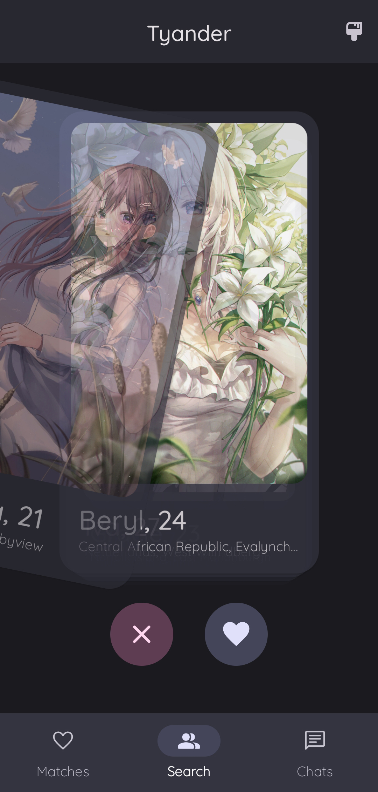
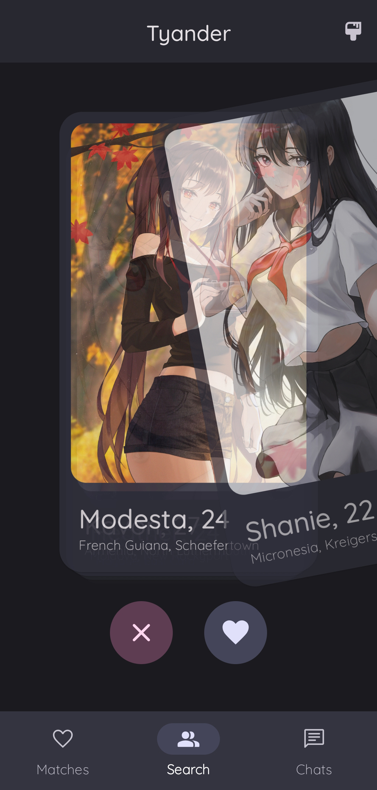
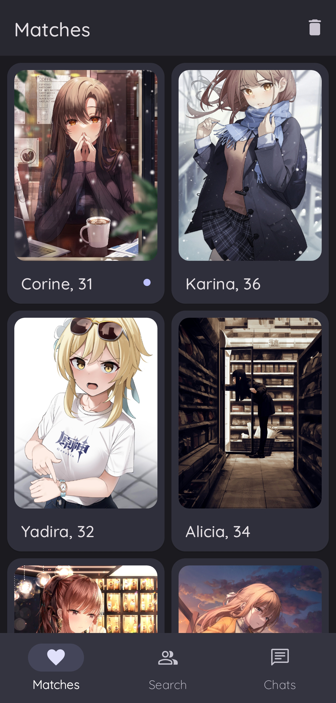
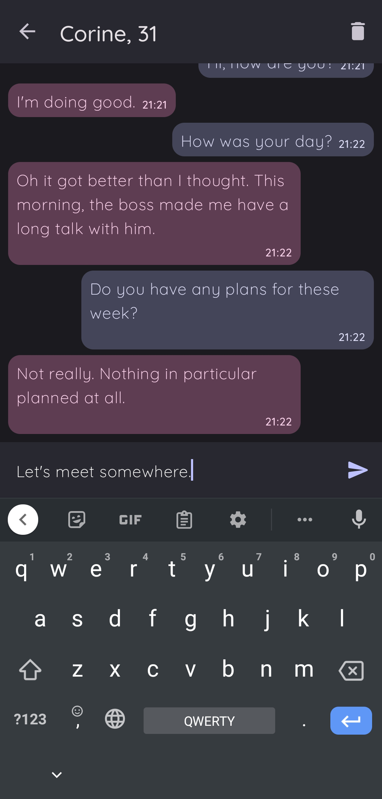

<div>
  
  <h1 style="margin-top: 0">Tyander</h1>
</div>

Tyander is a sample Android application for meeting and communicating with anime characters. 
Relying on [**waifu.im**](https://www.waifu.im), [**fakerapi.it**](https://fakerapi.it/en) and 
[**waifuai.com**](https://waifuai.com), Tyander allows to pick characters by photo, look through their 
biography, and chat with them via a simple messenger.


## Screenshots

<div style="width: 800px">
  <div align="center">
    
    
    
  </div>
  <div>
    
    
    
    
  </div>
</div>


## Technologies & Approaches

- [**Kotlin**](https://developer.android.com/kotlin)
  as programming language
  - [**kotlinx.DateTime**](https://github.com/Kotlin/kotlinx-datetime) 
    for date & time manipulations
- [**Coroutines**](https://kotlinlang.org/docs/coroutines-overview.html)
  as asynchronous and multithreading operations framework
- [**Dagger Hilt**](https://developer.android.com/training/dependency-injection/hilt-android)
  for dependency injection
- [**XML**](https://developer.android.com/develop/ui/views/layout/declaring-layout)
  for building user interface layouts
  - [**Material Design 3**](https://m3.material.io)
    as user interface design toolkit
  - [**ViewBinding**](https://developer.android.com/topic/libraries/view-binding)
    for accessing .xml view hierarchy
  - [**Custom View**](https://developer.android.com/develop/ui/views/layout/custom-views/custom-components)
    for building complex user interface elements
- **Single Activity Architecture** 
  for user interface structuring
  - [**Fragments**](https://developer.android.com/guide/fragments)
    for managing user interface destinations
- [**androidx.Lifecycle**](https://developer.android.com/topic/libraries/architecture/lifecycle)
  for implementing **Model-View-ViewModel** pattern
- [**Navigation Component**](https://developer.android.com/guide/navigation)
  for navigation
  - [**Safe Args**](https://developer.android.com/guide/navigation/navigation-pass-data#Safe-args)
    for transferring type-safe data between destinations
- [**ViewPager 2**](https://developer.android.com/guide/navigation/navigation-swipe-view-2)
  for displaying layouts as a stack of pages
- [**Coil**](https://coil-kt.github.io/coil)
  for loading images
- [**Retrofit 2**](https://square.github.io/retrofit)
  for network communication with APIs
  - [**kotlinx.Serialization**](https://github.com/Kotlin/kotlinx.serialization)
      for JSON parsing
  - **Scalars Converter**
    for handling raw text responses
  - [**JakeWharton Json Converter**](https://github.com/JakeWharton/retrofit2-kotlinx-serialization-converter)
    for handling JSON responses
- [**Room**](https://developer.android.com/training/data-storage/room)
  for deploying & managing local database
- [**Preferences DataStore**](https://developer.android.com/topic/libraries/architecture/datastore#preferences-datastore) 
  as key-value pairs storage
- [**Gradle Kotlin DSL**](https://developer.android.com/studio/build/migrate-to-kts) 
  for managing build configurations


## Unique Features

**i.e. what is unique among other samples?**

- **Custom View** for displaying a single 
  [**chat message**](https://github.com/rskopyl/Tyander/blob/main/app/src/main/java/com/rskopyl/tyander/ui/chat/messaging/MessageView.kt)
- **ViewPager 2** for displaying infinite
  [**characters stack**](https://github.com/rskopyl/Tyander/blob/main/app/src/main/res/layout/fragment_search.xml) 
  while searching
  - Custom **Page Transformer** for achieving 
  [**multiside dragging**](https://github.com/rskopyl/Tyander/blob/main/app/src/main/java/com/rskopyl/tyander/ui/search/StackPageTransformer.kt) 
  performed on skip and like actions
- Several **ViewTypes** for managing both
  [**user and character messages**](https://github.com/rskopyl/Tyander/blob/main/app/src/main/java/com/rskopyl/tyander/ui/chat/messaging/MessageAdapter.kt)
  within a single RecyclerView adapter
- Retrofit **POST request** for
  [**querying the chat API**](https://github.com/rskopyl/Tyander/blob/main/app/src/main/java/com/rskopyl/tyander/data/remote/MessageApi.kt)
- Parallel API requests via **async** for 
  [**obtaining picture and biography**](https://github.com/rskopyl/Tyander/blob/main/app/src/main/java/com/rskopyl/tyander/repository/impl/CharacterRepositoryImpl.kt)
  of the characters simultaneously


##  License

```
MIT License

Copyright (c) 2023 Rostyslav Kopyl

Permission is hereby granted, free of charge, to any person obtaining a copy
of this software and associated documentation files (the "Software"), to deal
in the Software without restriction, including without limitation the rights
to use, copy, modify, merge, publish, distribute, sublicense, and/or sell
copies of the Software, and to permit persons to whom the Software is
furnished to do so, subject to the following conditions:

The above copyright notice and this permission notice shall be included in all
copies or substantial portions of the Software.

THE SOFTWARE IS PROVIDED "AS IS", WITHOUT WARRANTY OF ANY KIND, EXPRESS OR
IMPLIED, INCLUDING BUT NOT LIMITED TO THE WARRANTIES OF MERCHANTABILITY,
FITNESS FOR A PARTICULAR PURPOSE AND NONINFRINGEMENT. IN NO EVENT SHALL THE
AUTHORS OR COPYRIGHT HOLDERS BE LIABLE FOR ANY CLAIM, DAMAGES OR OTHER
LIABILITY, WHETHER IN AN ACTION OF CONTRACT, TORT OR OTHERWISE, ARISING FROM,
OUT OF OR IN CONNECTION WITH THE SOFTWARE OR THE USE OR OTHER DEALINGS IN THE
SOFTWARE.
```